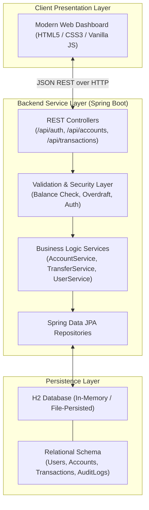

# 🏦 ApexBank - Next-Gen Java Banking System

[](https://openjdk.org/)
[](https://spring.io/projects/spring-boot)
[](https://maven.apache.org/)
[](https://www.h2database.com/)
[](https://developer.mozilla.org/en-US/docs/Web/JavaScript)
[](LICENSE)

A robust, enterprise-grade, full-stack **Online Banking & Financial Management System** built with **Java (Spring Boot)** on the backend and an intuitive, modern glassmorphic dashboard on the frontend. 

The application simulates real-world commercial banking processes—including customer onboarding, KYC registration, multi-tier account handling (Savings & Current/Checking), secure atomic funds transfers, transactional mini-statements, and administrative auditing.

---

## 📑 Table of Contents

- [🌟 Features](#-features)
- [🏛️ System Architecture](#️-system-architecture)
- [💻 Tech Stack](#-tech-stack)
- [📂 Project Structure](#-project-structure)
- [🔌 REST API Reference](#-rest-api-reference)
- [🚀 Quick Start Guide](#-quick-start-guide)
  - [Prerequisites](#prerequisites)
  - [1. Backend Setup](#1-backend-setup)
  - [2. Frontend Setup](#2-frontend-setup)
- [🧪 Default Test Accounts](#-default-test-accounts)
- [🛡️ Security & Integrity](#️-security--integrity)
- [🗺️ Roadmap](#️-roadmap)
- [🤝 Contributing](#-contributing)
- [📜 License](#-license)

---

## 🌟 Features

### 👤 Customer & Account Management
- **Customer Onboarding**: Create customer profiles with personal info, email, phone, and secure password.
- **Multi-Account Types**:
  - **Savings Account**: Generates interest with minimum balance thresholds.
  - **Current / Checking Account**: High-volume transactions with overdraft allowance limits.
- **Unique Account Generation**: Automatic generation of standard ISO-style bank account numbers (`ACC-XXXXXXXX`).
- **Real-Time Balance Inquiries**: Instant ledger calculation and balance checking.

### 💸 Core Banking Operations
- **Cash Deposit**: Credit money instantly into any active account.
- **Cash Withdrawal**: Concurrency-safe debiting with overdraft and balance validation.
- **Inter-Account Funds Transfer**: 
  - Send money between internal customer accounts using Account Number.
  - **ACID-Compliant Transactions**: Rollback on failure, preventing double-spending or money loss during crashes.
- **Transaction History & Passbook**:
  - Detailed audit records for every debit, credit, and transfer.
  - Categorized records (`DEPOSIT`, `WITHDRAWAL`, `TRANSFER_OUT`, `TRANSFER_IN`).
  - Search and filter transactions by date range or transaction type.

### 🛡️ Administrative Portal
- **Global Overview**: System-wide statistics (Total Accounts, Total Deposits, Total Transactions, Active Liquidity).
- **Customer Directory**: View and manage all registered customers and their associated accounts.
- **Account Freeze / Unfreeze**: Flag suspicious accounts or activate pending accounts.
- **Audit Trails**: Complete transparency log of all monetary actions across the bank.

### 🎨 Responsive Modern Web UI
- Responsive layout optimized for desktop, tablet, and mobile screens.
- Dark / Light mode banking themes with smooth animations.
- Dynamic interactive charts displaying monthly cash inflow vs. outflow.
- Modal dialogs for transfers, deposits, and statement exports.

---

## 🏛️ System Architecture



---

## 💻 Tech Stack

| Component | Technology | Purpose |
| :--- | :--- | :--- |
| **Language** | Java 21 / 25 LTS | Core platform and object-oriented backend logic |
| **Framework** | Spring Boot 3.4.x | REST API server, Dependency Injection, MVC |
| **ORM / Data Access** | Spring Data JPA / Hibernate | Entity mapping and repository queries |
| **Database** | H2 Database | Embedded SQL database with browser-based web console |
| **Build & Dependencies** | Maven Wrapper (`mvnw`) | Standard reproducible build without requiring pre-installed Maven |
| **Frontend** | Modern HTML5, CSS3, ES6+ JavaScript | Fast, dependency-free interactive user interface |
| **Icons & Fonts** | Feather / FontAwesome & Inter Font | Modern typography and dashboard iconography |

---

## 📂 Project Structure

```text
Banking-System-Java-/
│
├── Backend/                                # Java Spring Boot Application
│   ├── src/
│   │   ├── main/
│   │   │   ├── java/com/bank/system/
│   │   │   │   ├── BankingApplication.java   # Spring Boot Main Entry Point
│   │   │   │   ├── controller/               # REST API Controllers
│   │   │   │   │   ├── AccountController.java
│   │   │   │   │   ├── AuthController.java
│   │   │   │   │   └── TransactionController.java
│   │   │   │   ├── model/                    # JPA Entities
│   │   │   │   │   ├── Account.java
│   │   │   │   │   ├── Transaction.java
│   │   │   │   │   ├── User.java
│   │   │   │   │   └── enums/                # AccountType, TransactionType, AccountStatus
│   │   │   │   ├── repository/               # Spring Data JPA Repositories
│   │   │   │   │   ├── AccountRepository.java
│   │   │   │   │   ├── TransactionRepository.java
│   │   │   │   │   └── UserRepository.java
│   │   │   │   ├── service/                  # Business Logic Layer
│   │   │   │   │   ├── AccountService.java
│   │   │   │   │   ├── TransactionService.java
│   │   │   │   │   └── UserService.java
│   │   │   │   └── dto/                      # Data Transfer Objects & Payloads
│   │   │   │       ├── DepositRequest.java
│   │   │   │       ├── TransferRequest.java
│   │   │   │       └── WithdrawRequest.java
│   │   │   └── resources/
│   │   │       ├── application.properties    # App Configuration & H2 settings
│   │   │       └── data.sql                  # Seed data for initial demo
│   │   └── test/                             # Unit & Integration Tests
│   ├── pom.xml                               # Maven Project Object Model
│   ├── mvnw                                  # Maven Wrapper (Unix / Linux / macOS)
│   └── mvnw.cmd                              # Maven Wrapper (Windows)
│
├── Frontend/                               # Web Presentation Tier
│   ├── index.html                            # Customer & Admin Dashboard UI
│   ├── styles.css                            # Modern Responsive Styling & Themes
│   └── Main.js                               # Frontend API Client & DOM Handlers
│
├── .gitignore                              # Git exclusion rules
├── LICENSE                                 # Project License
└── README.md                               # Project Documentation
```

---

## 🔌 REST API Reference

### 🔐 Authentication & Users
| Method | Endpoint | Description | Payload Example |
| :--- | :--- | :--- | :--- |
| `POST` | `/api/auth/register` | Register a new customer | `{"fullName":"Alice Smith", "email":"alice@mail.com", "password":"secret", "role":"CUSTOMER"}` |
| `POST` | `/api/auth/login` | Authenticate and obtain session/user info | `{"email":"alice@mail.com", "password":"secret"}` |
| `GET` | `/api/users/{id}` | Retrieve customer profile | *None* |

### 💳 Accounts
| Method | Endpoint | Description | Payload Example |
| :--- | :--- | :--- | :--- |
| `POST` | `/api/accounts` | Create an account for a user | `{"userId":1, "accountType":"SAVINGS", "initialDeposit":500.00}` |
| `GET` | `/api/accounts/{accountNumber}` | Get account details and current balance | *None* |
| `GET` | `/api/accounts/user/{userId}` | List all accounts belonging to a user | *None* |
| `PATCH` | `/api/accounts/{accountNumber}/status` | Admin: Freeze or activate account | `{"status":"FROZEN"}` |

### 💸 Transactions
| Method | Endpoint | Description | Payload Example |
| :--- | :--- | :--- | :--- |
| `POST` | `/api/transactions/deposit` | Deposit funds into an account | `{"accountNumber":"ACC-10001", "amount":250.00, "description":"Salary"}` |
| `POST` | `/api/transactions/withdraw` | Withdraw cash from an account | `{"accountNumber":"ACC-10001", "amount":50.00, "description":"ATM Cash"}` |
| `POST` | `/api/transactions/transfer` | Transfer funds to another account | `{"sourceAccount":"ACC-10001", "targetAccount":"ACC-10002", "amount":100.00, "pin":"1234"}` |
| `GET` | `/api/transactions/account/{accountNumber}` | Fetch mini-statement & transaction history | *None* |

### 📊 Admin Analytics
| Method | Endpoint | Description |
| :--- | :--- | :--- |
| `GET` | `/api/admin/metrics` | Retrieve total system balances, total accounts, and volume |
| `GET` | `/api/admin/accounts` | Retrieve all system accounts across all customers |

---

## 🚀 Quick Start Guide

### Prerequisites
- **Java JDK**: Version 21 or higher (OpenJDK 21 or 25 recommended). Verify with:
  ```powershell
  java -version
  ```
- **Git**: Installed and available in your command line.
- A modern web browser (Google Chrome, Firefox, Microsoft Edge, Safari).

---

### 1. Backend Setup

1. Open your terminal and navigate to the `Backend` directory:
   ```powershell
   cd Backend
   ```

2. Run the application using the Maven Wrapper:
   - **On Windows**:
     ```powershell
     .\mvnw.cmd spring-boot:run
     ```
   - **On Linux / macOS**:
     ```bash
     chmod +x mvnw
     ./mvnw spring-boot:run
     ```

3. The backend server will initialize on port **`8080`**:
   - Backend Base URL: `http://localhost:8080`
   - Built-in H2 Web Console: `http://localhost:8080/h2-console`
     - **JDBC URL**: `jdbc:h2:mem:bankdb`
     - **Username**: `sa`
     - **Password**: *(leave blank)*

---

### 2. Frontend Setup

1. Open the `Frontend` directory:
   ```powershell
   cd ../Frontend
   ```

2. You can launch `index.html` directly in your browser:
   - Double-click `index.html`, **or**
   - Serve using any static server (like VS Code Live Server, or Python, or Node):
     ```powershell
     # Using Python
     python -m http.server 3000

     # Or using Node / npx
     npx serve .
     ```
3. Open `http://localhost:3000` (or the direct `file:///.../Frontend/index.html`) to access the Banking Portal.

---

## 🧪 Default Test Accounts

For demonstration and testing purposes, pre-seeded accounts are initialized at startup:

| Account No | Account Holder | Account Type | Initial Balance | Role |
| :--- | :--- | :--- | :--- | :--- |
| `ACC-10001` | Alice Johnson | Savings | \$5,420.00 | Customer |
| `ACC-10002` | Bob Miller | Current / Checking | \$12,850.00 | Customer |
| `ACC-99999` | Bank System Admin | Treasury | \$1,000,000.00 | Administrator |

---

## 🛡️ Security & Integrity

- **ACID Transactions**: Transfer operations run inside `@Transactional` blocks; if debit succeeds but credit fails, the operation automatically rolls back.
- **Overdraft & Balance Guards**: Prevents negative balance states on non-credit accounts.
- **Account Validation**: Validates recipient account existence before executing transfers.
- **Input Sanitization**: DTO validation prevents invalid, zero, or negative transaction amounts.
- **CORS Configured**: Pre-configured Cross-Origin Resource Sharing permits frontend web requests.

---

## 🗺️ Roadmap

- [ ] JWT (JSON Web Token) authentication with Spring Security.
- [ ] Exportable PDF statements using OpenPDF / iText.
- [ ] Simulated 2-Factor Authentication (OTP via simulated SMS/Email).
- [ ] International currency conversion using live exchange rate APIs.
- [ ] Fixed Deposit (FD) and Recurring Deposit (RD) interest calculation scheduler.

---

## 🤝 Contributing

Contributions are welcome! Please follow these steps:

1. **Fork** the repository.
2. Create a feature branch: `git checkout -b feature/AmazingFeature`.
3. Commit your changes: `git commit -m 'Add AmazingFeature'`.
4. Push to your branch: `git push origin feature/AmazingFeature`.
5. Open a **Pull Request**.

---

## 📜 License

This project is licensed under the **MIT License** — feel free to use, modify, and distribute it for academic or personal projects.